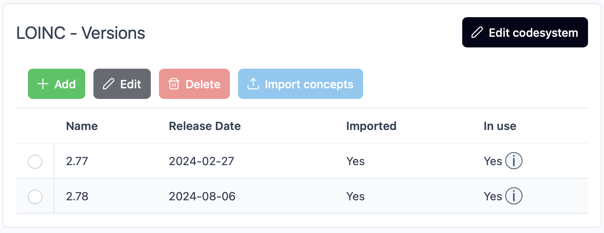
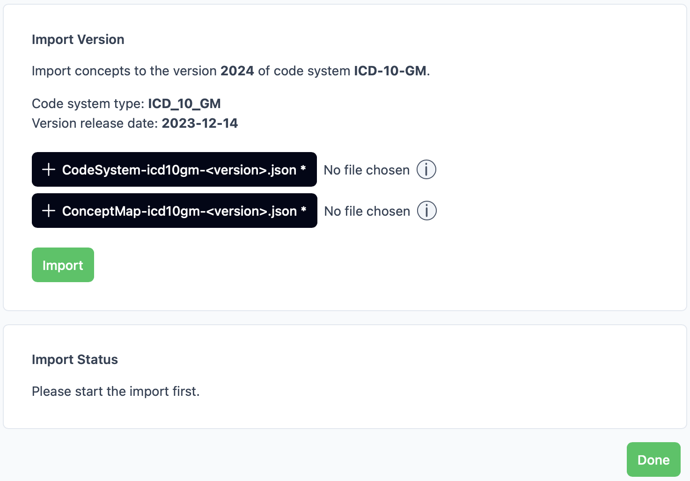
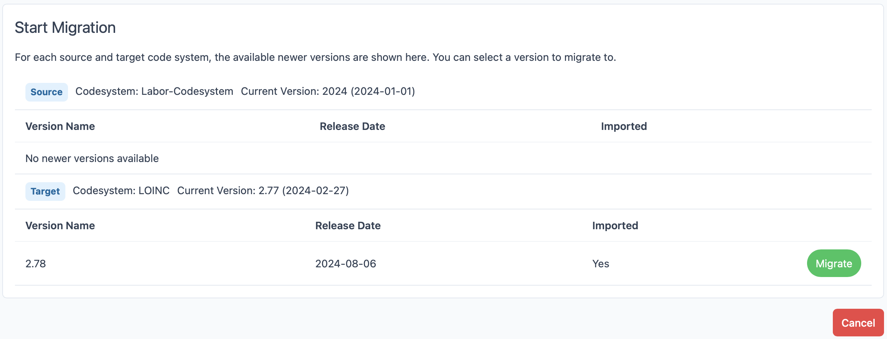
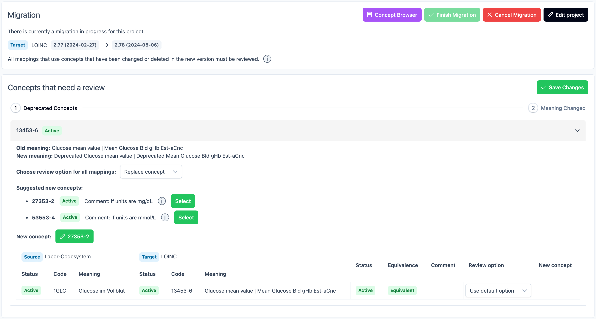

# MIRACUM Mapper Frontend

This is the frontend repository for the MIRACUM Mapper project. It provides a web interface which interacts with the backend. It is a Vue 3 project with Vite as the build tool. The corresponding backend repository can be found [here](https://github.com/miracum/MIRACUM-Mapper-2.0-backend)

<!-- ## Disclaimer - Not ready for use yet

This project is currently in the development phase and not reliably functioning. It is under very active development which means that the codebase is changing rapidly and may not be stable. As soon as this changes and the project is ready for use, this disclaimer will be removed. -->

## Features

- **Projects** can be created to group **Mappings** together which map codes from a specific set of codeSystems to another set of codeSystems. The access to projects for users can be managed with projectPermissions
- **CodeSystems** and their corresponding **Codes** can be imported in different formats (e.g CSV, FHIR/JSON). The changes between imported versions of codeSystems are computed automatically and stored efficiently in the database
- The used version of a codeSystem in a project can be upgraded in a process called *Migration*, where all changes of concepts which are used in mappings have to be reviewed
- The **User Management** is handled by **KeyCloak** and the backend is able to authenticate users against it
- Efficient Querying of the codes from the codeSystems is possible with the use of filters

### Manage CodeSystems



### Import Concepts



### Create a Project


### View Projects


### Mappings


### Create Mappings


### Migrate Projects to newer Versions



### Review changed Concepts



## Architecture

The frontend is a [Vue 3](https://vuejs.org/) project with [Vite](https://vite.dev/) as the build tool. It uses the [Vue Router](https://router.vuejs.org/) for routing and [Pinia](https://pinia.vuejs.org/) for state management. [PrimeVue](https://primevue.org/) (`v4`) is used as the component library. [TailwindCSS](https://tailwindcss.com/) classes are used for styling. The project was started with JavaScript and got migrated to [TypeScript](https://www.typescriptlang.org/) during the development. Therefore not all parts of the codebase are fully typed yet. In order to automatically generate client code for the api, [openapi-typescript](https://openapi-ts.dev/) is used. In order to communicate with [KeyCloak](https://www.keycloak.org/) and handle the authentication flow, [keycloak-js](https://www.npmjs.com/package/keycloak-js) is used.

## Quick Start

The application can be build and run using Docker. A `Dockerfile` and `docker-compose.yaml` files are provided for this purpose. For development it is recommended to use the provided Dev-Container. For production Nginx is used to serve the bundled frontend and provide certificates for `https`.

There are different guides depending on how the application should be set up and run:

- If you want to contribute to the project and actively develop something, see the [Development Guide](/docs/setup/development.md)
- If you want to test the application (e. g. import codesystems, create projects and mappings) without changing the code, see the [Test Guide](/docs/setup/testing.md)
- If you want to deploy the application for production or on a test system, see the [Deployment Guide](/docs/setup/deployment.md)

## Configuration

The Frontend can be configured using a `.env` file. The following environment variables can be used:

```.env
VITE_KEYCLOAK_URL=http://localhost:8081/
VITE_KEYCLOAK_CLIENT_ID=miracum-mapper
VITE_KEYCLOAK_REALM=master
VITE_APP_URL=http://localhost:5173
VITE_API_URL=http://localhost:8080
```

The `VITE_KEYCLOAK_URL` is the url of the KeyCloak server. The `VITE_KEYCLOAK_CLIENT_ID` is the client id of the KeyCloak client. The `VITE_KEYCLOAK_REALM` is the realm of the KeyCloak server. The `VITE_APP_URL` is the url of the frontend. The `VITE_API_URL` is the url of the backend.
