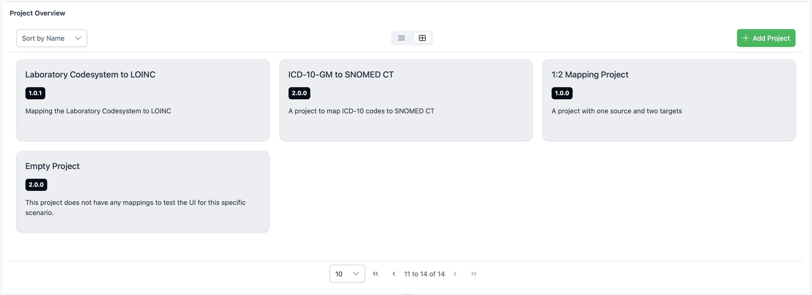
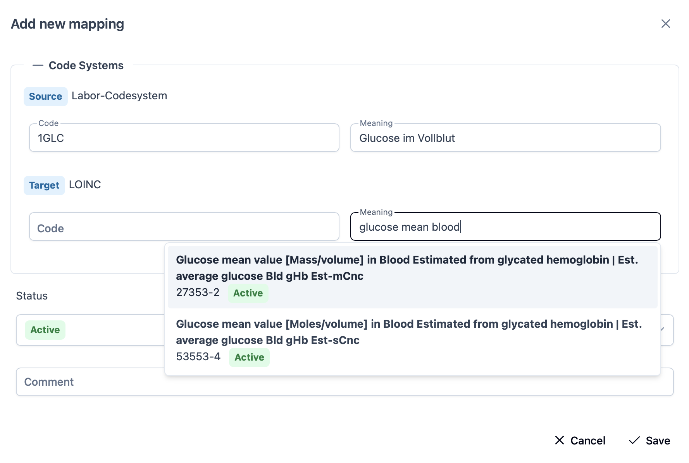

# MIRACUM Mapper Frontend

This is the frontend repository for the MIRACUM Mapper project. It provides a web interface which interacts with the backend. It is a Vue 3 project with Vite as the build tool. The corresponding backend repository can be found [here](https://github.com/miracum/MIRACUM-Mapper-2.0-backend)

## Disclaimer - Not ready for use yet

This project is currently in the development phase and not reliably functioning. It is under very active development which means that the codebase is changing rapidly and may not be stable. As soon as this changes and the project is ready for use, this disclaimer will be removed.

## Architecture

The frontend is a [Vue 3](https://vuejs.org/) project with [Vite](https://vite.dev/) as the build tool. It uses the [Vue Router](https://router.vuejs.org/) for routing and [Pinia](https://pinia.vuejs.org/) for state management. [PrimeVue](https://primevue.org/) (`v4`) is used as the component library. [TailwindCSS](https://tailwindcss.com/) classes are used for styling. The project was started with JavaScript and got migrated to [TypeScript](https://www.typescriptlang.org/) during the development. Therefore not all parts of the codebase are fully typed yet. In order to automatically generate client code for the api, [openapi-typescript](https://openapi-ts.dev/) is used. In order to communicate with [KeyCloak](https://www.keycloak.org/) and handle the authentication flow, [keycloak-js](https://www.npmjs.com/package/keycloak-js) is used.

## Features

- Projects can be created to group mappings together which map codes from a specific set of codeSystems to another set of codeSystems. The access to projects for users can be managed with projectPermissions
- CodeSystems and their corresponding Codes can be imported in different formats (e.g CSV)
- The User Management is handled by KeyCloak and the backend is able to authenticate users against it
- Efficient Querying of the codes from the codeSystems is possible with the use of filters

### Create a Project


### View Projects



### Mappings


### Create Mappings



## Recommended IDE Setup

[VSCode](https://code.visualstudio.com/) + [Vue - Official](https://marketplace.visualstudio.com/items?itemName=Vue.volar) (and disable Vetur).

## Type Support for `.vue` Imports in TS

TypeScript cannot handle type information for `.vue` imports by default, so we replace the `tsc` CLI with `vue-tsc` for type checking. In editors, we need [Vue - Official](https://marketplace.visualstudio.com/items?itemName=Vue.volar) to make the TypeScript language service aware of `.vue` types.

## Project Setup

First make sure to have npm installed on your machine. Then run the following command to install the dependencies:

```sh
npm install
```

After installing the dependencies, you can run the following commands to run and develop the project:

### Compile and Hot-Reload for Development

```sh
npm run dev
```

The frontend is then available under `http://localhost:5173`.

### Type-Check, Compile and Minify for Production

```sh
npm run build
```

The Dockerfile runs this command to build the project and serve it with Nginx.

### Lint with [ESLint](https://eslint.org/)

```sh
npm run lint
```

## Container Setup

To run the frontend in a Docker Container for Deployment, Nginx is used which serves the compiled frontend and also provides certificates for `https`. First of all, you have to create certificates. For local development, Self Signed Certificates can be created with the following command:

```
mkdir certs
openssl req -x509 -newkey rsa:4096 -keyout certs/key.pem -out certs/cert.pem -sha256 -days 3650 -nodes -subj "/C=XX/ST=StateName/L=CityName/O=CompanyName/OU=CompanySectionName/CN=CommonNameOrHostname"
```

Afterwards, a network between the frontend and the backend has to be created by running

```sh
docker network create public_network
```

The network is used for the services to communicate with each other. In the backend repository, the `external: true` in the public_network section of the ``docker-compose.yaml` has to be commented in. Also in the [.env](./.env) file in this repository the section with the docker environment variables has to be commented in and the development variables have to be commented out. Then start the frontend with the following command:

```sh
docker compose up --build
```

The frontend is then available under `https://localhost`. Communication with the backend and keycloak is done through the nginx server.

### Dev Container

A Dev Container is provided to run the project in a containerized environment and make development easy as it has all prerequisites installed. To use it, you need to have Docker installed on your machine. The Dev Container Extension for VSCode is also recommended. Please refer to the [Dev Container Documentation](https://code.visualstudio.com/docs/remote/containers) for more information.

### Generate Client Code

To regenerate autogenerated code based on [openapi.yaml](./api/openapi.yaml) run the following command:
(We use this generator https://openapi-ts.dev/)

```sh
npm run generate
```

### Configuration

The Frontend can be configured using a `.env` file. The following environment variables can be used:

```.env
VITE_KEYCLOAK_URL=http://localhost:8081/
VITE_KEYCLOAK_CLIENT_ID=miracum-mapper
VITE_KEYCLOAK_REALM=master
VITE_APP_URL=http://localhost:5173
VITE_API_URL=http://localhost:8080
```

The `VITE_KEYCLOAK_URL` is the url of the KeyCloak server. The `VITE_KEYCLOAK_CLIENT_ID` is the client id of the KeyCloak client. The `VITE_KEYCLOAK_REALM` is the realm of the KeyCloak server. The `VITE_APP_URL` is the url of the frontend. The `VITE_API_URL` is the url of the backend.

## Build for Production

In order to build the frontend for production, first the certificates for nginx need to be generated. Afterwards, a shared network between the frontend and the backend docker containers needs to be created, in order for nginx to be able to communicate with the backend. Currently the `docker-compose.yaml` file together with the nginx config is setup to make the api available under an `/api` path. So the api which is not `https` protected gets proxied through the nginx server which is `https` protected. If the server domain is `miracum-mapper.de` the api would be available under `https://miracum-mapper.de/api` and the frontend under `https://miracum-mapper.de/`. More information about the deployment can be seen in the [backend-repository](https://github.com/miracum/MIRACUM-Mapper-2.0-backend). An overview of the current deployment can be seen in the graphic below:


